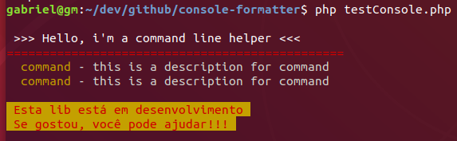

# Console Formatter
Classe para formatação de texto no console.

## Versão
0.0.0 - Esta é a primeira versão de desenvolvimento. Não adicionei nenhuma
numeração ainda, por que nenhuma versão estável está disponível. A ideia é
seguit o padrão que se segue, porém, ainda não não dou nenhuma garantia de
continuidade do projeto neste mesmo formato.

## instalação
No momento, você pode instalar a lib escolhendo uma destas opções.

**Utilizando o Composer**
```bash
composer require gabrielmendonca/console-formatter
```

**Fazendo o clone repositório no git**

```bash
git clone https://github.com/brunoom1/console-formatter.git
```

## Métodos disponíveis
- str (**String** $content) - ***Conteúdo a ser apresentado***
- color (**Integer** $color) - ***Adiciona uma cor ao texto no console***
- background (**Integer** $color) - ***Adiciona uma cor ao fundo do console***
- separatorStyle1() - ***Adicionar um separador de linha***
- ln() - ***Pula para uma nova linha***
- tab() - ***Adicionar um tab a linha atual***

## Uso
```php
<?php
  require dirname(__FILE__) . '/vendor/autoload.php';

  use gabrielmendonca\ConsoleFormatter;

  $formatter = new ConsoleFormatter();
  echo $formatter
    -> ln()
    -> str(" >>> Hello, i'm a command line helper <<<")
    -> color(ConsoleFormatter::COLOR_RED)
    -> separatorStyle1()
    -> color() // reset to default color

    -> tab ()
    -> color(ConsoleFormatter::COLOR_YELLOW)
    -> str("command")
    -> color() // reset to default color
    -> str(' - this is a description for command')
    -> ln()

    -> tab ()
    -> color(ConsoleFormatter::COLOR_YELLOW)
    -> str("command")
    -> color() // reset to default color
    -> str(' - this is a description for command')
    -> ln()

    -> background(ConsoleFormatter::COLOR_YELLOW)
    -> color(ConsoleFormatter::COLOR_RED)
    -> str(" Esta lib está em desenvolvimento ") -> ln()
    -> str(" Se gostou, você pode ajudar!!! ")
    -> background() -> color()
    -> ln()
    -> ln();

?>    
```

Saida:



## Dependências desenvolvimento

- **PHP Unit:**
Esta é a única dependência do projeto por enquanto e só foi instalada para o
ambiênte de desenvolvimento, pra que o projeto possa ser testado de maneira
mais simplês.

## Licença

Manterei a licença Apache 2.0
